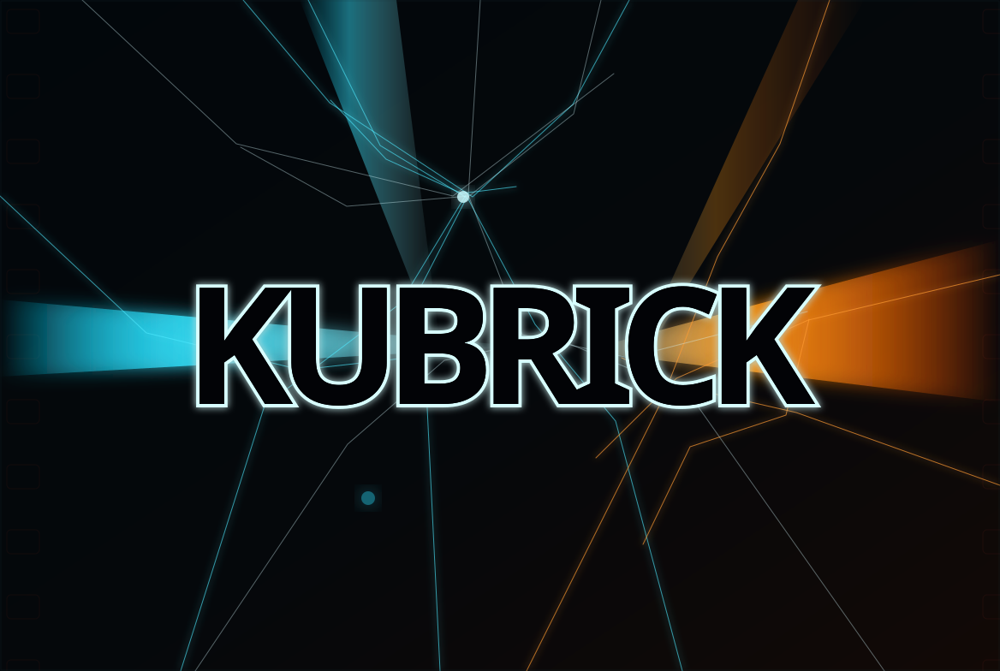

<p align="center">
  
</p>

<h1 align="center">Kubrick</h1>

<p align="center">
  <strong>Hermes-Native Symbolic Cinematic Engineering</strong><br>
  <em>0.13.0 — Forge Feedback • Multi-Provider Adapters • Operator Surface</em>
</p>

<p align="center">
  <a href="https://github.com/scrimshawlife-ctrl/Kubrick/releases"></a>
  <a href="https://github.com/scrimshawlife-ctrl/Kubrick"></a>
  <a href="https://github.com/scrimshawlife-ctrl/Kubrick/issues"></a>
  <a href="LICENSE"></a>
  <a href="#installation"></a>
</p>

<p align="center">
  <strong>Observed form first. Dramatic function first. Hidden architecture made executable.</strong>
</p>

---

**Kubrick** is a self-contained Hermes skill for screenplay development, scene diagnosis, motif engineering, cinematic encoding, storyboard continuity, generative prompt construction, and closed-loop visual QA.

It converts dramatic pressure into observable geometry, behavior, rhythm, material state, light, sound, convergence, and residue. Esoteric and archetypal source systems remain latent by default: audience-facing packets expose enforceable cinematic constraints rather than named occult concepts.

## 0.13.0 Highlights

- **Forge multi-signal feedback** — ledger diffs, revisions, saturation, collisions, ingestion, and payoff outcomes become deterministic observation bundles.
- **Multi-signal evolution** — confidence, mutation success, production feasibility, anti-slop, cultural boundaries, and payoff realization feed proposal-only evolution with human review gates.
- **First-class project ledgers** — persistent motif state, pattern history, and retrieval snapshots; Forge remains canonical.
- **Multi-provider adapters** — Grok Imagine, Flux, SD3, and Midjourney share one latent graph; adapters change syntax only.
- **Closed-loop visual QA** — observation → differential scoring → targeted correction, with geometry/state/residue/convergence reported separately.
- **CLI + optional MCP operators** — saturation, counterpoint, convergence locking, surface-occult audit, motif mutation, and symbolic-architecture export.
- **Time-sensitive cultural-signal packs** — contemporary memetic patterns ship with provenance and validity windows.
- **Fail-closed governance** — weak evidence returns `NOT_COMPUTABLE`; no structural change applies automatically.

## Core Philosophy

- **Observed first, meaning second** — every motif begins as concrete form, behavior, relation, or material state.
- **Dramatic function before symbolism** — symbolic design must change pressure, agency, causality, or interpretation.
- **Mandatory mutation** — recurrence changes scale, ownership, orientation, material, rhythm, framing, context, or consequence.
- **Three-channel symbolism** — diegetic, dramaturgical, and cinematic channels cross without explanatory dialogue.
- **Constraint over citation** — source traditions become geometry, rhythm, threshold, role persistence, transformation, and residue.
- **Fail closed** — weak evidence or unresolved boundaries return `NOT_COMPUTABLE`.
- **Human-governed evolution** — local outputs remain observations or proposals until explicitly approved.

## Installation

```bash
git clone https://github.com/scrimshawlife-ctrl/Kubrick.git
cd Kubrick
./install.sh
```

Default destination:

```text
~/.hermes/skills/kubrick
```

Install repository validation dependencies when developing locally:

```bash
python -m pip install pyyaml jsonschema
```

Validate the installed skill:

```bash
python ~/.hermes/skills/kubrick/scripts/kubrick.py validate-skill
```

Continuity Forge, MCP servers, generation APIs, and vision APIs remain optional.

## Unified Pipeline

```bash
python scripts/kubrick.py compile \
  --brief examples/authority-transfer-storyboard/brief.yaml \
  --ledger examples/authority-transfer-storyboard/symbolic-ledger.yaml \
  --mode storyboard \
  --storyboard-plan examples/authority-transfer-storyboard/storyboard-plan.yaml \
  --provider grok-imagine \
  --out out/kubrick/authority-transfer
```

The compiler performs:

```text
brief
→ registry-aware retrieval
→ private motif graph
→ structural and anti-slop audit
→ audience constraints
→ storyboard state propagation
→ transition comparison
→ neutral model-adapter packet
→ Grok Imagine prompt packet
→ schema receipts
→ compile receipt
```

## Operator Commands

```text
validate-skill          validate Hermes skill structure
validate-corpus         validate executable pattern sidecars
coverage                audit corpus and registry coverage
compile                 run the unified compiler
retrieve                run registry-aware deterministic retrieval
ledger                  initialize, audit, or mutate local project state
storyboard-propagate    propagate graph state across frames
storyboard-compare      inspect frame-to-frame continuity
adapter-build           build a provider-neutral adapter packet
adapt-grok              emit Grok Imagine prompt packets
adapt-flux / adapt-sd3 / adapt-midjourney
closed-loop-qa          differential visual QA loop
forge-signals           extract multi-signal Forge observations
evolution-propose       multi-signal proposal-only evolution
operator                saturation, counterpoint, lock, audit, export
mcp-server              optional stdio MCP wrapper
artifact-validate       validate YAML or JSON against a repository schema
repeatability           compare stable hashes across two clean compiles
eval                    run the standalone Hermes regression suite
```

## Verification

```bash
python scripts/kubrick.py validate-skill
python scripts/kubrick.py validate-corpus
python scripts/kubrick.py coverage
python scripts/kubrick.py eval
python scripts/test_outcome_governance.py
python scripts/test_wave2_wave3.py
python scripts/kubrick.py repeatability --output out/kubrick/repeatability-report.json
python scripts/audit_release_version.py --strict
```

## Documentation

| File | Purpose |
|---|---|
| `SKILL.md` | Canonical Hermes operating contract |
| `QUICKSTART.md` | Installation and command routing |
| `docs/ROADMAP-v0.13.md` | Current roadmap and post-release priorities |
| `docs/RELEASE-NOTES-v0.13.md` | v0.13 release notes |
| `docs/RELEASE-CHECKLIST-v0.13.md` | Release gates and procedure |
| `references/hermes-runtime-contract.md` | Runtime, dependency, artifact, and canon policy |
| `references/patterns/` | Executable pattern sidecars |
| `schemas/` | Machine-readable artifact contracts |
| `evals/` | Regression and adversarial specifications |

## Version

**0.13.0 — Forge Feedback, Multi-Provider Adapters, and Operator Surface**

See [CHANGELOG.md](CHANGELOG.md) for release history.

---

<p align="center">
  <em>Symbolism should alter the conditions under which a scene is interpreted—without requiring the audience to consciously identify it.</em>
</p>
