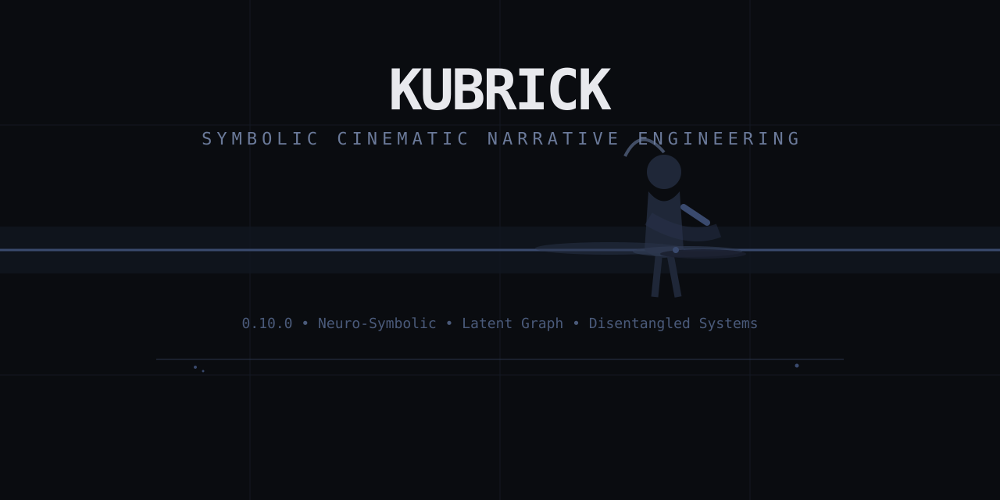

<p align="center">
  
</p>

<h1 align="center">Kubrick</h1>

<p align="center">
  <strong>Symbolic Cinematic Narrative Engineering</strong><br>
  <em>0.10.0 — Neuro-Symbolic • Latent Motif Graph • Disentangled Systems</em>
</p>

<p align="center">
  <a href="https://github.com/scrimshawlife-ctrl/Kubrick/releases/tag/v0.10.0"></a>
  <a href="LICENSE"></a>
  <a href="https://github.com/scrimshawlife-ctrl/Kubrick/releases"></a>
</p>

---

**Kubrick** is a disciplined symbolic operating system for cinematic narrative. It engineers motifs, geometry, light, and relational structure into scripts and single-frame generative work — always starting from observable form and state differentials.

It resists generic AI writing, occult collage, and one-to-one symbolism. Meaning emerges through recurrence, mutation, convergence, and interlocking systems.

## 0.10.0 Highlights

- **Internal Motif/Structure Graph Layer** — Neuro-symbolic graph (nodes = observed states, edges = relational pressure & transformation) powers the Dynamic Selection Engine.
- **Explicit Disentanglement** — Layout/Geometry, Semantics/Function, and Attributes/States are factored for cleaner, more controllable interlocking.
- **Compositional Layered Encoding** — Convergence masking and independent layers with controlled interaction at key sites (CMA/MLS-inspired).
- **Full Esoteric–Alchemical Encoding Lexicon** — 200+ entries translated exclusively through observable constraint.
- **Conditioning-Style Prompt Engineering** — Precise control signals for geometry, state differentials, dual light, and residue.
- Enhanced single-frame state modeling with stronger differentials and perceptual layering.

## Core Philosophy

- **Observed first, meaning second** — Every element begins with concrete, observable behavior and material state.
- **Mandatory mutation** — No motif recurs without transformation.
- **Three-channel symbolism** — Diegetic, Dramaturgical, and Cinematic channels cross to create power without explanation.
- **Constraint over citation** — Ancient and esoteric structures enter only as enforceable rules on geometry, light, trace, and relation.

## Key Features

- **Neuro-Symbolic Motif Graph** — Internal graph drives latent concept selection and prompt construction.
- **Dynamic Latent Esoteric–Alchemical Selection Engine** — Automatically interlocks concepts from the full lexicon based on prompt content.
- **Cinematic Symbolism Corpus** — Expanded systems for Light, Geometry, Trace, Inversion, and Perceptual Layering.
- **Single-Frame & Generative Image Mastery** — State differentials, convergence points, and relational pressure encoded directly into prompts.
- **Forge-native output** — Produces `symbolic_intent`, `motif_registry`, `cinematic_encoding`, and `symbolic_architecture` ready for Continuity Forge.
- Full anti-slop gates (A–W) and provenance tracking.

## Installation

```bash
# Copy into your Hermes skills directory
cp -R /path/to/kubrick ~/.hermes/skills/kubrick

# Recommended companion
cp -R /path/to/hermes-continuity-forge ~/.hermes/skills/
```

## Quick Start

Load `kubrick` and use natural language:

- “Develop this premise with strong symbolic architecture and motif lifecycle.”
- “Diagnose this scene for motif mutation and geometric pressure.”
- “Rewrite this scene but keep the convergence site locked with active state differentials.”
- “Produce a production-ready Grok image prompt for a man in the city who has just lost his job using full 0.10.0 density.”

See `examples/beach-threshold.md` for a complete worked example including private hidden correspondence, full symbolic packet, and ready-to-use prompt.

## Core Artifacts

- `symbolic_intent` (dramatic_function required)
- `motif_registry` (observed_form first + lifecycle)
- `cinematic_encoding` (disentangled systems + convergence)
- `symbolic_architecture` (Forge handoff)

## Documentation

| File | Purpose |
|------|---------|
| `references/symbolic-dramaturgy.md` | Core laws, motif graph, profound integration rules |
| `references/cinematic-symbolism-corpus.md` | Expanded systems + Neuro-Symbolic Conditioning Patterns |
| `references/esoteric-alchemical-lexicon.md` | Full 200+ entry lexicon (latent use only) |
| `references/anti-slop-patterns.md` | Gates A–W |
| `examples/beach-threshold.md` | Complete 0.10.0 single-frame example |
| `SKILL.md` | Full capability reference |

## Version

**0.10.0** — Neuro-Symbolic & Compositional Upgrades

See [CHANGELOG.md](CHANGELOG.md) for the complete history.

---

*Symbolism should alter the conditions under which a scene is interpreted — without requiring the audience to consciously identify it.*