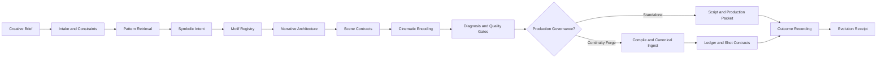

# Kubrick

**Deterministic symbolic narrative engineering for Hermes.**

Kubrick is a standalone Hermes skill for developing, diagnosing, revising, and preparing cinematic narratives with controlled motif systems, visual grammar, dramatic causality, and production-aware continuity.

It converts a creative brief into explicit narrative contracts and traceable symbolic architecture—without reducing symbols to fixed meanings or allowing cinematic style to override character agency, causality, or feasibility.

> **Observed form first. Dramatic function second. Interpretation remains latent.**

[Quickstart](QUICKSTART.md) · [Skill specification](SKILL.md) · [Changelog](CHANGELOG.md)

---

## Why Kubrick

Most generative writing systems can produce pages. Kubrick is designed to produce a **coherent cinematic operating system** behind those pages.

It provides:

- **Narrative engineering** from premise through scene-level execution
- **Motif lifecycle control**, requiring meaningful mutation across recurrence
- **Three-channel symbolism** across diegetic, dramaturgical, and cinematic form
- **Deterministic pattern retrieval** with scoring, exclusions, provenance, and receipts
- **Anti-slop diagnosis** for exposition, symbolic redundancy, cliché, obscurity, and continuity drift
- **Production-facing artifacts** such as scene contracts, cinematic encoding, and symbolic architecture
- **Optional Continuity Forge handoff** for canonical ingestion, ledgers, revision safety, and shot contracts
- **Evidence-based evolution** from recorded project outcomes rather than opaque autonomous rewriting

Kubrick is a Hermes skill—not a Python package—and works without Continuity Forge.

---

## Core Principle

A symbol should alter the conditions under which a scene is interpreted without requiring the audience to consciously identify or decode it.

Kubrick therefore models symbolism as a transformation process:

```text
observable form
    ↓
contextual association
    ↓
recurrence under new pressure
    ↓
formal mutation
    ↓
convergence with character choice
    ↓
retrospective legibility
```

The system rejects the weaker pattern:

```text
symbol appears → symbol is explained → meaning is delivered
```

---

## Workflow



### 1. Intake and constraint extraction

Kubrick begins by separating what is known from what is merely suggested.

Typical inputs include:

- format and target duration
- premise, dramatic question, and intended audience effect
- character pressures and irreversible choices
- genre and production constraints
- visual, sonic, spatial, or cultural references
- locked canon and prohibited changes
- desired deliverables: logline, beat sheet, script, diagnosis, rewrite, or production packet

The result is a bounded creative problem rather than an unrestricted generation prompt.

### 2. Deterministic pattern retrieval

Kubrick searches its symbolic pattern corpus using the project brief, exclusions, genre context, dramatic function, and saturation constraints.

```bash
python scripts/retrieve_symbolic_patterns.py \
  --brief evals/retrieval/inputs/sample_melodrama_lowbudget.yaml
```

The retriever emits a `retrieval_receipt` containing ranked patterns, score decomposition, provenance, exclusions, and fallback state. When the available evidence is insufficient, retrieval returns `NOT_COMPUTABLE` rather than inventing a recommendation.

### 3. Symbolic intent contract

Before motifs are selected, Kubrick defines why symbolic structure is needed.

A valid `symbolic_intent` specifies:

- the dramatic function
- the pressure or contradiction being externalized
- the interpretive field being altered
- the channels in which the system may operate
- boundaries that prevent one-to-one symbolism or unsupported cultural equivalence

Purely decorative or esoteric symbolism is rejected.

### 4. Motif registry and lifecycle

Each motif begins with observable form—not an assigned meaning.

Kubrick records:

- physical or behavioral form
- first narrative context
- channel usage
- recurrence points
- pressure applied at each recurrence
- required mutation
- inversion, fracture, convergence, or exhaustion state
- collision and saturation risk

A motif may recur unchanged only when stagnation itself is the dramatic point.

### 5. Narrative architecture

The symbolic system is integrated with ordinary dramatic engineering:

1. premise
2. character objectives and contradictions
3. world rules
4. thematic tensions
5. macrostructure
6. sequences and beats
7. scene engines
8. dialogue and prose
9. continuity state
10. revision logic

Symbolism remains subordinate to agency, causality, clarity, tone, and production feasibility.

### 6. Scene contracts

Before or alongside screenplay pages, Kubrick can create scene contracts that define:

- scene objective
- source of pressure
- value change
- entrance and exit state
- character knowledge
- continuity dependencies
- active motifs and required mutations
- blocking and spatial relationships
- visual and sonic recurrence rules
- production constraints

These contracts make scenes testable and reduce narrative compression or visual drift during downstream generation.

### 7. Cinematic encoding

Kubrick translates narrative and symbolic decisions into filmable form through `cinematic_encoding`:

- relational composition
- geometric patterns
- blocking systems
- camera behavior
- shot recurrence and mutation
- edit cadence
- sonic motifs
- lighting and production-design states

The emphasis is relational. A centered frame, circular move, threshold, or repeated sound is only useful when its behavior changes with dramatic conditions.

### 8. Diagnosis and revision

Kubrick supports eight operating modes:

| Mode | Purpose |
|---|---|
| `DEVELOP` | Build premise, characters, structure, and symbolic architecture |
| `DRAFT` | Generate scenes or screenplay pages from approved foundations |
| `DIAGNOSE` | Identify structural, symbolic, continuity, and execution failures |
| `REVISE` | Change material while preserving locked constraints and canon |
| `POLISH` | Improve dialogue, rhythm, specificity, and voice without structural drift |
| `CONTINUITY` | Audit state, recurrence, knowledge, and motif lifecycle consistency |
| `PRODUCTION` | Produce scene contracts, cinematic encoding, and handoff packets |
| `ADAPT` | Change format while preserving dramatic core and symbolic grammar |

Diagnosis applies the standard anti-slop gates plus symbolic gates for:

- symbol explanation
- occult collage
- symbolic redundancy
- one-to-one symbolism
- repetition without mutation
- archetype costume
- tradition flattening
- numerology inflation
- symbolic supremacy
- mystery by obscurity
- premature interpretive closure

### 9. Optional Continuity Forge handoff

Kubrick creates proposals. Continuity Forge can make approved material canonical.

```text
Kubrick
  creative development
  symbolic architecture
  scene contracts
  cinematic encoding
        ↓
Continuity Forge
  compile
  canonical ingest
  ledger
  mutation control
  shot contracts
  drift audit
```

Typical handoff operations:

```bash
continuity-forge compile <script-or-outline> --out <output-directory>
```

For governed writes, acquire a lease and ingest with a complete mutation contract, including actor identity, authorization scope, idempotency key, rationale, and expected state hash.

After ingestion, the Forge ledger and intermediate representation become the source of truth. Local Kubrick artifacts remain proposals unless committed through Forge.

See [`references/continuity-forge-integration.md`](references/continuity-forge-integration.md) for the exact integration procedure.

### 10. Outcome recording and controlled evolution

Kubrick improves retrieval rankings from explicit project evidence.

Retrievals are logged under:

```text
references/usage/receipts/
```

After a project, sequence, revision, or Forge handoff, record outcomes under:

```text
references/usage/outcomes/
```

Then run:

```bash
python scripts/evolve_from_use.py
```

The evolution engine may update:

- pattern confidence
- usage history
- corpus ordering
- overuse or weakness flags
- recommendations for human-reviewed structural changes

It does **not** autonomously invent new governing patterns or rewrite the corpus without review. Every run emits an evolution receipt.

---

## Installation

### Recommended

```bash
git clone https://github.com/scrimshawlife-ctrl/Kubrick.git
cd Kubrick
./install.sh
```

This installs Kubrick to:

```text
~/.hermes/skills/kubrick
```

For Hermes installations organized by category:

```bash
./install.sh creative
```

This installs to:

```text
~/.hermes/skills/creative/kubrick
```

Restart Hermes after installation.

### Development symlink

Use a symbolic link when actively modifying the skill:

```bash
mkdir -p ~/.hermes/skills
ln -s "$(pwd)" ~/.hermes/skills/kubrick
```

### Manual installation

```bash
mkdir -p ~/.hermes/skills
cp -R . ~/.hermes/skills/kubrick
```

No Continuity Forge installation is required for standalone use.

---

## Quick Start

### In Hermes

Use a natural-language request that activates the skill:

```text
Develop this premise into a feature outline with a controlled motif lifecycle,
relational cinematic geometry, and scene-level symbolic pressure.
```

Other useful requests:

```text
Diagnose this scene for motif repetition, exposition, and geometric drift.
```

```text
Rewrite this sequence while keeping the broken-circle motif and circular
blocking locked, but mutate their function under the protagonist's new choice.
```

```text
Create a production handoff with scene contracts, cinematic encoding,
shot recurrence rules, and symbolic architecture.
```

### From the command line

Run the included retrieval example:

```bash
python scripts/retrieve_symbolic_patterns.py \
  --brief evals/retrieval/inputs/sample_melodrama_lowbudget.yaml
```

A minimal brief and expected output pair is also available in:

```text
examples/minimal-retrieval-example.zip
```

---

## Core Artifacts

| Artifact | Purpose |
|---|---|
| `symbolic_intent` | Defines the dramatic purpose and limits of symbolic work |
| `motif_registry` | Records observable motifs, channels, recurrence, and lifecycle |
| `motif_lifecycle` | Specifies pressure-driven mutation across appearances |
| `cinematic_encoding` | Converts narrative relationships into composition, blocking, camera, edit, sound, and design rules |
| `symbolic_architecture` | Packages the complete symbolic system for production or Forge handoff |
| `scene_contract` | Defines scene causality, state changes, continuity, motifs, and visual execution |
| `retrieval_receipt` | Preserves ranked pattern results, scoring, exclusions, and provenance |
| `evolution_receipt` | Records corpus-confidence changes derived from explicit outcomes |
| `revision_diff` | Tracks symbolic and continuity effects of a proposed revision |

---

## Three Symbolic Channels

| Channel | Surface | Typical evidence |
|---|---|---|
| **Diegetic** | Elements inside the story world | objects, gestures, architecture, costume, sound, repeated behavior |
| **Dramaturgical** | Causal and structural repetition | choices, reversals, roles, thresholds, bargains, repeated situations |
| **Cinematic** | Formal presentation | framing, geometry, movement, rhythm, light, sound placement, editing |

The strongest motifs cross channels without every channel stating the same thing.

---

## Repository Map

```text
Kubrick/
├── SKILL.md                         # Hermes behavior, routing, gates, and procedures
├── QUICKSTART.md                    # Minimal installation and execution path
├── CHANGELOG.md                     # Version history
├── install.sh                       # Hermes installer
├── scripts/
│   ├── retrieve_symbolic_patterns.py
│   └── evolve_from_use.py
├── references/
│   ├── patterns/                    # Machine-readable pattern sidecars
│   ├── corpus/                      # Genre and domain pattern packs
│   ├── usage/                       # Retrieval receipts, outcomes, and ledgers
│   ├── evolution/                   # Evolution receipts
│   ├── symbolic-dramaturgy.md
│   └── continuity-forge-integration.md
├── evals/                           # Retrieval and behavior evaluation fixtures
└── examples/                        # Minimal working examples
```

---

## Design Boundaries

Kubrick:

- **does** develop and assess narrative material
- **does** create explicit symbolic and cinematic contracts
- **does** produce provenance-linked recommendations and receipts
- **does** integrate with Continuity Forge when available
- **does not** own canonical production state
- **does not** treat archetypes as declared character identities
- **does not** flatten distinct traditions into unsupported equivalence
- **does not** allow symbolism to override causality or character agency
- **does not** claim `NOT_COMPUTABLE` problems have been solved

---

## Companion System

Use [`hermes-continuity-forge`](https://github.com/scrimshawlife-ctrl/continuity-forge) when the project requires:

- canonical state management
- deterministic compilation
- write leases and mutation contracts
- scene and shot identifiers
- continuity ledgers
- drift detection
- revision-safe production handoffs

Kubrick remains fully usable without it.

---

## Version

**0.8.0 — Executable Retrieval + Self-Evolution**

See [CHANGELOG.md](CHANGELOG.md) for release details.
